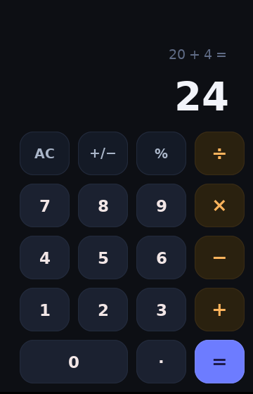

# Calculator



A fully functional calculator built with Morph. Demonstrates reactive state, conditional JSX rendering, typed functions, and flexbox keypad layout.

## What it shows

- **`morphState`** — reactive state for current value, accumulator, operator, and display mode
- **Conditional JSX** — `{op !== 0 && <span>{acc} {opSym}</span>}` hides the expression when no operator is active
- **Typed functions** — `:double` and `:int` type annotations on `compute()`, `pressDigit()`, etc.
- **Flexbox layout** — grid keypad with `flex-wrap`, gap, and `justify-content`
- **Window constraints** — `minWidth`/`maxWidth`/`minHeight`/`maxHeight` lock the window to fixed dimensions
- **Keyboard input** — window-level `onKeyDown`/`onKeyUp` on `<body>` (works without clicking first) plus a class-free pressed flash via reactive inline styles

## Keyboard shortcuts

Type directly — no click needed. Numpad and top-row keys both work.

| Key | Action |
|---|---|
| `0`–`9` | Digits |
| `+` `-` `*` `/` | Add, subtract, multiply, divide |
| `x` | Multiply (alias) |
| `Enter` or `=` | Equals — previous expression stays on top (e.g. `5 + 3 =`) |
| `.` | Decimal point |
| `%` | Percent (÷ 100) |
| `Backspace`, `Escape`, `c` | Clear (AC) |

Holding a key lights its button exactly like a mouse press (same `:active` colors, driven by the `activeKey` state + reactive `backgroundColor`).

## Run

```bash
cd examples/calculator
morph dev          # live window with hot reload
# or
morph run          # build + run optimized binary
```
