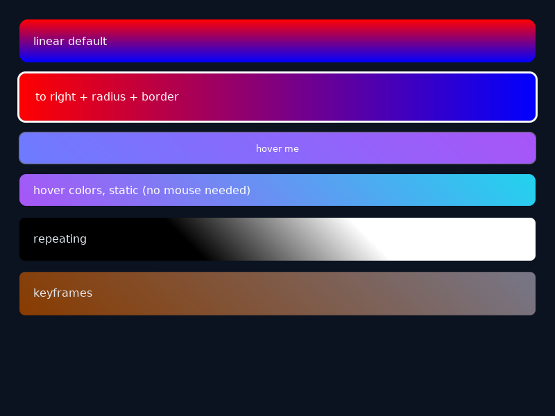

# Gradient Test

Visual test for `linear-gradient()` / `repeating-linear-gradient()` backgrounds:
static paint, `:hover` / `:active` states, and `@keyframes` animation.



## What each box shows (top to bottom)

1. **linear default** — `linear-gradient(red, blue)`: default direction is
   `to bottom`, so red on top fading to blue at the bottom, with
   `border-radius: 12px`.
2. **to right + radius + border** — `linear-gradient(to right, #ff0000 0%,
   #0000ff 100%)`: red on the left fading to blue on the right, white
   3px border following the same rounded corners.
3. **hover me** (button) — `linear-gradient(45deg, #6d7cff, #a855f7)` at
   rest. Hovering swaps to a purple→teal gradient
   (`#a855f7 → #22d3ee`); pressing (`:active`) swaps to solid orange
   (`#ff8800`, gradient removed).
4. **hover colors, static** — the exact hover gradient baked in as a plain
   style, so the hover look is verifiable without a mouse.
5. **repeating** — `repeating-linear-gradient(45deg, black 0 10px, white
   10px 20px)`: diagonal black/white stripes tiling every 20px, clipped to
   `border-radius: 8px`.
6. **keyframes** — `animation: gradShift 3s infinite`: continuously morphs
   angle and colors (`0deg` red/blue → `90deg` green/yellow → back), so the
   box is caught mid-blend in screenshots.

## Run

```bash
cd tests/runtime/render/gradient-test
morph run
# headless self-test (no display needed):
morph build --no-upx --self-test && ./.morph/output/gradient-test --morph-self-test
```
